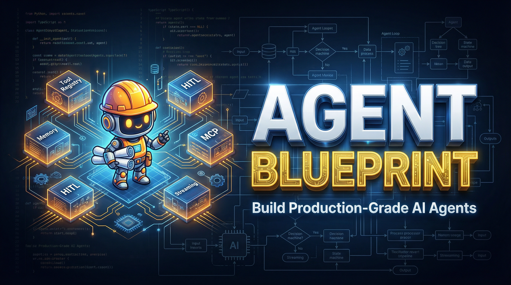

<div align="center">

</div>

# agent-blueprint

> Build production-grade AI agents from scratch. Complete patterns, templates, and reference implementations for any language or framework.

## What This Is

A skill for AI coding agents (Claude Code, Cursor, etc.) that guides you through building complete agentic systems — tool registries, permission systems, context management, streaming APIs, human-in-the-loop workflows, and HTTP serving layers.

**Two audiences:**
- **Workflow builders** — planner + executor pipelines, HITL checkpoints, multi-agent orchestration
- **Application embedders** — HTTP/SSE APIs, multi-user session management, React frontend integration

## Install

```bash
npx skills add OthmanAdi/agent-blueprint -g
```

Works with Claude Code, Cursor, and any agent that supports the skills protocol. Then just describe what you want to build — the skill activates automatically.

## What's Inside

```
agent-blueprint/
  SKILL.md                    # Main skill — loaded by the agent
  references/                 # Deep-dive docs (load on demand)
    agent-loop.md             # Streaming agent loop (Python)
    typescript-agent-loop.md  # Streaming agent loop (TypeScript/Bun)
    tool-system.md            # Tool registry & execution pipeline
    permission-system.md      # 7-layer permission pipeline
    context-management.md     # Context window lifecycle
    system-prompts.md         # Prompt caching patterns
    mcp.md                    # MCP server integration
    memory.md                 # Session persistence & long-term memory
    rust-agent.md             # Rust implementation (tokio + reqwest)
    production-principles.md  # 85% compounding problem, Manus principles
    planner-executor.md       # Three-agent pattern (planner/executor/verifier)
    human-in-the-loop.md      # HITL approval matrix & tiered delegation
    serving.md                # FastAPI + SSE, multi-user sessions
    long-tasks.md             # File-based planning for 100+ step tasks
    observability.md          # Tracing, OpenTelemetry, cost dashboards
    cost-optimization.md      # Prompt caching, model routing, batch API
    framework-guide.md        # LangGraph vs Mastra vs Vercel AI SDK 2026
    architecture.md           # System diagram & dependency graph
  templates/
    minimal-agent/            # ~200 lines Python, 2 tools
    coding-agent/             # Full coding assistant, 9 tools
    research-agent/           # Web search + report generation
    task-agent/               # Multi-step orchestration
    workflow-agent/           # Planner + executor + HITL
    api-agent/                # FastAPI + SSE + React frontend
  examples/
    python-coding-agent.md    # Claude Code clone walkthrough
    typescript-research-agent.md
    multi-agent-orchestrator.md
  scripts/
    validate_agent.py         # Check your agent has all required components
    scaffold.py               # Generate project from template
```

## Example Prompt

> Build me a Python workflow agent that processes customer support tickets. Pull tickets from Postgres, classify them with an LLM into 5 categories, route urgent ones to Slack and low-priority to email. Ask for my approval before sending anything. Log every decision. Use the workflow-agent template with human-in-the-loop checkpoints.

The skill picks the right template, loads the relevant references, and generates a complete working project.

## Language Support

| Language | Templates | Examples |
|----------|-----------|---------|
| Python | All 6 templates | 2 examples |
| TypeScript/Bun | Reference implementation | 1 example |
| Rust | Full reference | tokio + reqwest |

## License

Apache 2.0 — see [LICENSE](./LICENSE).

---

> **Disclaimer:** This project is not affiliated with, endorsed by, or associated with Anthropic PBC. "Claude" and "Claude Code" are trademarks of Anthropic. No Anthropic source code is included in this repository. All implementations are original and independently written.
